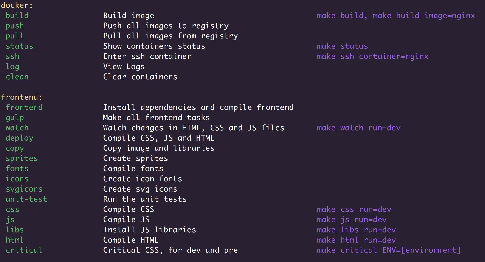

# Example of simple Makefile

```
# Makefile

build: ## build image : make build, make build image=nginx
	@docker-compose -f docker-compose.build.yml build ${image}

help:
	@printf "\033[31m%-30s %-45s %s\033[0m\n" "Target" "Help" "Usage"; \
	printf "\033[31m%-30s %-45s %s\033[0m\n" "------" "----" "-----"; \
	grep -hE '^\S+:.*## .*$$' $(MAKEFILE_LIST) | sed -e 's/:.*##\s*/:/' | sort | awk 'BEGIN {FS = ":"}; {printf "\033[32m%-16s\033[0m %-45s \033[34m%s\033[0m\n", $$1, $$2, $$3}'
```

## Result


## Explanation

- `\033[` - indicates the color schema. e.g. `31m` is red (see explanation of the color codes [here](https://travelingfrontiers.wordpress.com/2010/08/22/how-to-add-colors-to-linux-command-line-output/))
- `\033[0m` - indicates the end of the color schema
- `%-30` - indicates the width of the column in the printf
- `FS = ":"` - FS is the field separator, that means that the fields will be separated by `:` (more info [here](https://www.gnu.org/software/gawk/manual/html_node/Field-Separators.html))

# Example for Makefile with tasks categorization

```
css: ##@frontend Compile CSS : make css run=dev
	@$(NPM) run task:css --${run}

HELP_FUNC = \
	%help; \
	while(<>) { \
		if(/^([a-z0-9_-]+): .*\#\#(?:@(\w+))? ([a-zA-Z\., ]+)(?: : (.*))?$$/) { \
			push(@{$$help{$$2}}, [$$1, $$3, $$4]); \
		} \
	}; \
	printf ("\033[31m %-30s %-45s %s\033[0m\n", "Target", "Help", "Usage"); \
	printf ("\033[31m %-30s %-45s %s\033[0m\n", "------", "----", "-----"); \
	for ( sort keys %help ) { \
		printf ("\033[33m%s:\033[0m\n", $$_); \
		printf("\033[32m %-20s\033[0m %-45s \033[34m%s\033[0m\n", $$_->[0], $$_->[1], $$_->[2]) for @{$$help{$$_}}; \
		print "\n"; \
	}

help: ##@all Show this help.
	@perl -e '$(HELP_FUNC)' $(MAKEFILE_LIST)
```

## Result



# Other examples

- [https://gist.github.com/prwhite/8168133](https://gist.github.com/prwhite/8168133)